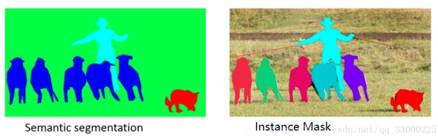

# COCO

# 链接

```
http://cocodataset.org
http://images.cocodataset.org/zips/train2017.zip
http://images.cocodataset.org/annotations/annotations_trainval2017.zip
http://images.cocodataset.org/zips/val2017.zip
http://images.cocodataset.org/annotations/stuff_annotations_trainval2017.zip
http://images.cocodataset.org/zips/test2017.zip
http://images.cocodataset.org/annotations/image_info_test2017.zip
```

# 示例




# 安装

1. 下载
```
# old
git clone https://github.com/cocodataset/cocoapi.git
cd cocoapi/PythonAPI
```

```
# new
git clone https://github.com/nightrome/cocostuffapi.git
cd cocoapi/PythonAPI
```

2. 编译
```
# linux
make
```

```
# win
python setup.py install
# python setup.py build_ext --inplace
```


# Demo

* demo.py

* eval.py


